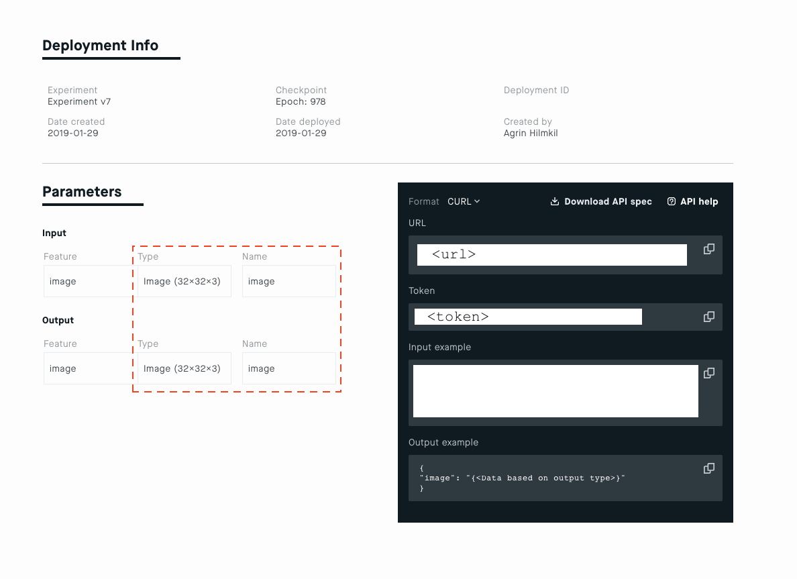

# Sidekick (Beta) [](https://travis-ci.com/Peltarion/sidekick)
This code is the sidekick to the superhero that is the Peltarion Platform. Sidekick
handles the mundane tasks like bundling up data into the Platform's preferred
format or sending data examples to the deployment endpoints to get predictions.

Sidekick's aim is to make it easier to
* get data in
* get predictions out

We hope that sidekick will help more people experience the end-to-end flow of a deep learning
project and appreciate the value that the Platform provides.


## Installation of sidekick
**Requirements** Sidekick requires python 3.5+.

When installing sidekick we recommend using a separate virtual environment, see e.g.
[the tutorial *Python virtual environments a primer*](https://realpython.com/python-virtual-environments-a-primer/).

Install package and dependencies with pip directly from GitHub:
```console
pip install git+ssh://git@github.com/Peltarion/sidekick.git#egg=sidekick
```

## Get data in - Create a Platform compatible dataset
When creating a dataset zip you can load the data in two separate ways.
Both require loading the data in a Pandas `DataFrame` and assume all columns
only contain one type of data with the same shape.

### 1) Load data in memory objects
Store objects directly in the `Series` (columns of your `DataFrame`). This
works for all scalars (floats, integers and strings of one dimension) as well
as [Pillow](https://pillow.readthedocs.io/en/stable/) images and numpy arrays.

**Example**

This is such an example with a progressbar enabled:

```python
df.head()
```
```
float_column          image_column                numpy_column
    0.248851  <PIL.Image.Image ...  [0.18680, 0.61951, 0.83...
    0.523621  <PIL.Image.Image ...  [0.75213, 0.44948, 0.82...
    0.647844  <PIL.Image.Image ...  [0.41525, 0.63858, 0.34...
    0.447717  <PIL.Image.Image ...  [0.79373, 0.24514, 0.94...
    0.194222  <PIL.Image.Image ...  [0.12636, 0.40554, 0.66...
```

```python
import sidekick

# Create dataset
sidekick.create_dataset(
    'path/to/dataset.zip',
    df,
    progress=True
)
```

### 2) Load data in paths to objects

Columns may also point to paths of object. Which columns are paths should be
indicated in the `path_columns`. Like the in-memory version these may also be
preprocessed.

**Example**

This is an example where all images are loaded from a path,
preprocessed to have the same shape and type and then placed in the dataset.

```python
df.head()
```
```text
float_column string_column                                  image_file_column
    0.248851           foo  /var/folders/7t/80jfy0rd3l7f31xdd3rw0_jw0000gn...
    0.523621           foo  /var/folders/7t/80jfy0rd3l7f31xdd3rw0_jw0000gn...
    0.647844           foo  /var/folders/7t/80jfy0rd3l7f31xdd3rw0_jw0000gn...
    0.447717           foo  /var/folders/7t/80jfy0rd3l7f31xdd3rw0_jw0000gn...
    0.194222           foo  /var/folders/7t/80jfy0rd3l7f31xdd3rw0_jw0000gn...
```

```python
import functools
import sidekick

# Create preprocessor for images, cropping to 32x32 and formatting as png
image_processor = functools.partial(
    sidekick.process_image, crop_size=(32, 32), format='png')

# Create dataset
sidekick.create_dataset(
    'path/to/dataset.zip',
    df,
    path_columns=['image_file_column'],
    preprocess={
        'image_file_column': image_processor
    }
)
```


## Get predictions out - Use a deployed experiment
To connect to an enabled deployment use the `sidekick.Deployment` class. This class
takes the information you find on the deployment page of an experiment.

**Example**

This example shows how to query an enabled deployment for image classification.



Use the `url` and `token` displayed in the dark box. Then, create a dictionary
of the Feature _Name_ and _Type_ (here `image` and `Image (32x32x3)`) fields
from the table of input and output parameters to specify `dtypes_in` and
`dtypes_out`.

```python
import sidekick

client = sidekick.Deployment(
    url='<url>',
    token='<token>',
    dtypes_in={'image': 'Image (32x32x3)'},
    dtypes_out={'image': 'Image (32x32x3)'}
)
```

This deployment client may now be used to get predictions for images

### Test deployment with one sample - predict

To predict result of one image (here `test.png`) use `predict`.

**Example**
```python
from PIL import Image

# Load image
image = Image.open('test.png')

# Get predictions from model
client.predict(image=image)
```
Note: If the feature name is not a valid python variable, e.g., `Image.Input`, use `predict_many` instead of `predict`.

### Test deployment with many samples - predict_many

To efficiently predict the results of multiple input samples (here, `test1.png`, `test2.png`) use
`predict_many`.

**Example**
```python
client.predict_many([
    {'image': Image.open('test1.png')},
    {'image': Image.open('test2.png')}
])
```

### Interactive exploration of data - predict_lazy

For interactive exploration of data it is useful to use the `predict_lazy`
method, which returns a generator that lazily polls the deployment when needed.
This allows you to immediatly start exploring the results instead of waiting
for all predictions to finnish.

**Example**
```python
client.predict_lazy([
    {'image': Image.open('test1.png')},
    {'image': Image.open('test2.png')}
])
```

### Object type and field type compatibility
Which object types are compatible with each field type may be shown by printing
the `sidekick.encode.DTYPE_COMPATIBLITY` dictionary.

```python
print(sidekick.encode.DTYPE_COMPATIBILITY)

{'Float': {float},
 'Int': {int},
 'Numpy': {numpy.ndarray},
 'Image': {PIL.Image.Image}}
```

# Examples
Examples of how to use sidekick are available at: [examples/](examples/)
